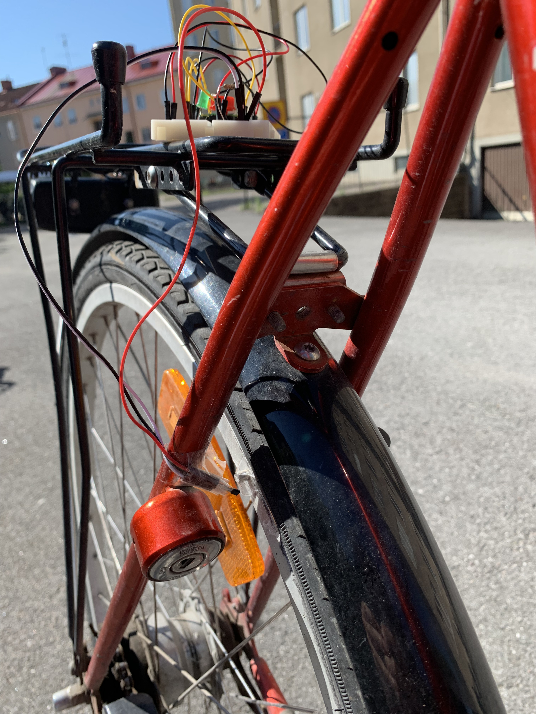
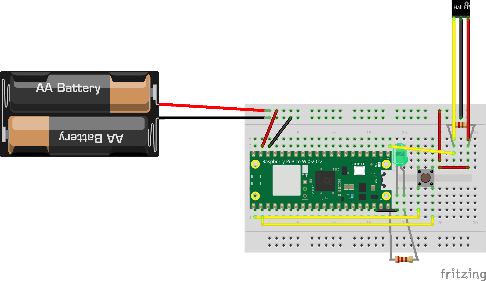
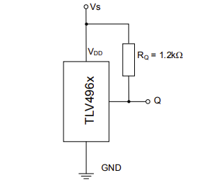
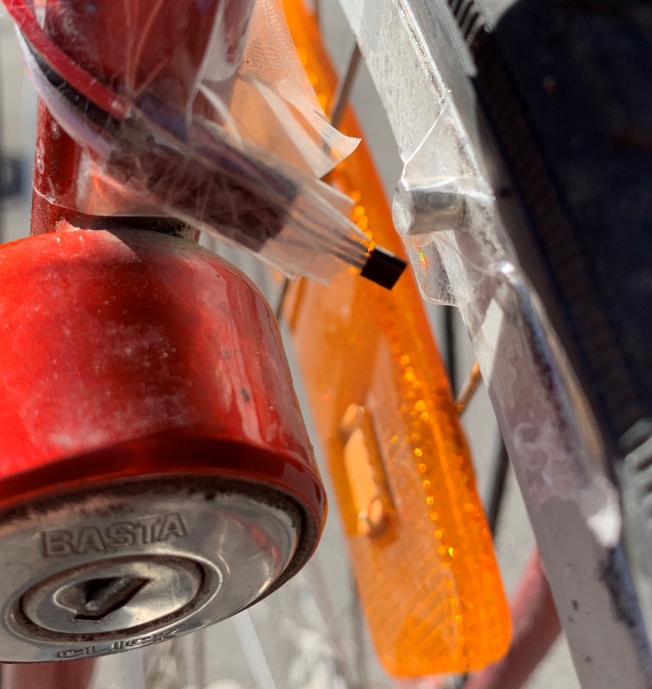
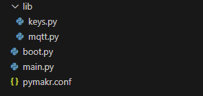
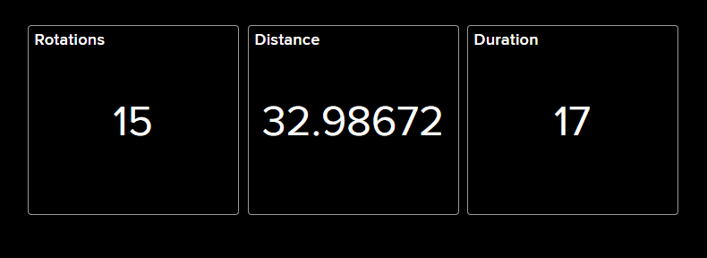

Author: Martin Karlsson
ID: mk225jy
# Tutorial on how to make your bike your first IoT project
This project is about creating a simple IoT solution for measuring how far you travel with your bike.
The device created in this project will be able to count the number of rotations a bike wheel makes, and 
with that data, calculate a distance. 

The project is relatively short and easy to complete. The time it takes to complete this project depends on the 
shipping time of the required hardware. Following this tutorial, the project should only take about 2-3 hours to complete. 

# Objective
The objective of this project is to measure how far you travel with you travel with your bike. 

The data is collected by a microcontroller attached to your bike, which sends data via Wifi to a dashboard on Adafruit 
using the MQTT protocol. 

Here's what the end result will look like: 




# Material
For this specific project I used the Raspberry Pi Pico WH. It is suitable for this project since it is also equipped with a 2.4GHz wireless interface. If you would like to read more about the RPi Pico WH, you can have a look at the [datasheet](https://datasheets.raspberrypi.com/picow/pico-w-datasheet.pdf).

To count the number of rotations your bike wheel makes, the [TLV49645 SIP-3](https://www.electrokit.com/uploads/productfile/41015/2343219.pdf) Hall-effect sensor is used. To use the sensor you also need a magnet. The sensor outputs a digital signal. 

To power the microcontroller you also need some sort of battery pack. The microcontroller needs at least 1.8V to power (5.5V maximum). I used a small battery pack with 2 AAA batteries.

Furthermore, you need a breadboard, some jumpers to connect sensors, and a micro-USB cable. You will need at least 3 male-to-female connectors that are at least 30 cm. They will be used to connect the sensor to the breadboard. If they are to short, it will be hard to position the sensor correctly. You will also need a button. The button can be replaced by just diconnecting a cable. 

| Material | Price(SEK) |
| ----------- | ----------- |
| Raspberry Pi Pico WH | 109 |
| Breadboard | 69 |
| Jumper Cables M-M | 29 |
| Jumper Cables M-F (30cm)| 49|
| micro-USB cable| 19 |
| TLV49645 SIP-3 | 18 |
| Magnet Neo35 Ø5mm x 5mm| 11 |
| Battery holder 2xAAA| 19 |
| 330&#937; resistor| 1 |
| **TOTAL** | **324** |

# Computer Setup
In this project [Visual Studio Code](https://code.visualstudio.com/) was used. To upload code to the Pico WH, the [pymakr](https://github.com/pycom/pymakr-vsc/blob/HEAD/GET_STARTED.md) extension was used.

Your OS should not matter in this project, so any OS is fine. 

## Step-by-step

1. Install [Python](https://www.python.org/downloads/) if you don't already have it.
2. Install [VSCode](https://code.visualstudio.com/) if you don't already have it.
3. Get the [PyMakr](https://github.com/pycom/pymakr-vsc/blob/HEAD/GET_STARTED.md) extension in VSCode.
4. Update the firmware on the microcontroller. If Raspberry Pi Pico is used, follow these steps:    
    1. Download the [MicroPython firmware](https://micropython.org/download/rp2-pico-w/). Use the one under "Releases" and not "Nightly Builds".
    2. Connect the Micro-USB cable to the Pico.
    3. Insert the other end of the cable to your computer, while holding down the BOOTSEL button of the RPi Pico. 
    4. A new device called RPI-RP2 should now show up in your file system. Move the file from step 1 into it's storage. 
    5. Wait. The board should automatically disconnect and then reconnect to your computer. This might take a while sometimes.
5. The setup is done! You're ready to code!

# Putting everything together
This diagram shows how to connect everything. Connections are explained in more detail below.



The hall effect sensor might be a bit tricky to connect. Make sure that you connect it using wires, and not directly to the breadboard. This ensures that we can easily position the sensor correctly. We also need to connect a resistor going from V<sub>S</sub> to the output. This is done to limit the current going through the sensor. From the data sheet:



Furthermore, we also need to recalculate R<sub>Q</sub>. The sensor is limited to an operating range of maximum 25mA. We're powering this sensor with two 1.5 AAA batteries. That's 3V in total. If R<sub>Q</sub> = 330&#937;, then I<sub>Q</sub> = 3/330, which is about 10mA. Perfect!

The green LED seen in the schematic is not a requirement for the device to function properly. Its purpose is to indicate that a Wi-Fi connection has been established, and that it is sending data via that connection.

We also need to attach this device to your bike. I used tape to secure the magnet to the side of the back wheel. I also taped the sensor to point at the side of the wheel, so that the magnet passes the sensor when the wheel rotates. The sensor needs to be quite close to the magnet in order to detect it. Here's how I attached my magnet and sensor:



When the magnet passes the sensor, there's about 5 between them. Another tip/trick I used was to paint the magnet on one side. This made it much easier to know which pole was which. 
# Platform
I used Adafruit for this project. It is a free and easy to use. It is capable of creating simple visualizations for your data. 

First, create an [Adafruit IO](https://io.adafruit.com/) account. Then, create three new feeds: rotations, distance and duration. If you're having trouble creating feeds, there's a guide [here](https://learn.adafruit.com/adafruit-io-basics-feeds).

# Code
The screenshot below shows how to structure your project.



The **lib** folder holds all essential libraries for this project. The [MQTT library](https://github.com/MartinKarlsson1337/iot-bike/blob/main/lib/mqtt.py) is already included in this directory. The file **keys.py** contains the credentials used in this project (WiFi password, Adafruit key, etc). You need to fill in your own credentials here. Leave the **AIO_CLIENT_ID** field as it is.

**boot.py** is a script that runs upon booting the microcontroller. It is empty and can remain empty.

**main.py** will run after **boot.py**. This file contains all logic specific to this project. Let's have a look at that code!

## Imports
First of, we need to import the libraries we need:
```
    import machine
    from machine import Pin
    import time
    import uasyncio
    import socket
    from mqtt import MQTTClient
    import ubinascii
    import math
    import network
    from lib.keys import *
```
Next, we setup some pins of the Raspberry Pi Pico WH:
```
    led_pin = Pin(15, mode=Pin.OUT)
    led_pin.low()

    high_pin = Pin(0, mode=Pin.OUT)
    high_pin.high()
```
**led_pin** is used to light up the green LED. **high_pin** is a pin that will be constantly high, and it is used with the button. The button will act as a gate, when pushed down, the signal from high_pin will be stopped.

There's also a class called **Bike_Session**. It is a class that represents a bike ride. Everytime we go out for a new bike ride, we should create an instance of this class. It keeps all the information related to the bike ride, such as: duration, number of rotations, etc. Here's the code:

```
class Bike_session(): # A bike session with a duration and a number of rotations

    def __init__(self):
        self.duration = 0 

        self.alive = True

        self.wheel_radius = 0.35 # wheel radius in meters   
        self.wheel_circumference = self.wheel_radius * 2 * math.pi # Wheel circumeference
        self.distance = 0 # Total distanced traveled

        self.start_time = time.time() # Start time
        self.rotations = 0

        self.sensor_pin = Pin(16, mode=Pin.IN) 
        self.sensor_pin.irq(handler=self.full_rotation_ISR, trigger=Pin.IRQ_FALLING) # Associate sensor pin with ISR. Trigger on an falling edge.

        self.switch_pin = Pin(1, mode=Pin.IN)
        self.switch_pin.irq(handler=self.unalive, trigger=Pin.IRQ_FALLING)

    def full_rotation_ISR(self, change): # ISR that increments rotations by one
        self.rotations += 1
        print(self.rotations) # For debugging

    def unalive(self, change):
        print("Unalive")
        print("END SESSION!")
        self.sensor_pin = None
        self.duration = time.time() - self.start_time
        self.distance = self.rotations * self.wheel_circumference
        self.alive = False
```
First of, you need to replace the `self.wheel_radius` variable value, with your bike's wheel radius. So take out a tape measure and do it! Measure from the center of the wheel to the edge of the tire.

The most interesting part of this class, is the interrupt we assign to GPIO16 and GPIO1. The `full_rotation_ISR` function will only run when the signal on GPIO16 is on a falling edge. In practice, this means that the function  will only trigger when the magnet triggers the sensor. 

`unalive` is a very stupid name for a function. Whenever the signal to GPIO1 is on a falling edge, this function will trigger. That signal will go from high to low, whenever the button is pressed. The function ends the current bike ride and calculates the duration and distance traveled. It sets `self.alive` to False, to let us know that the session is ended. We also set sensor_pin to None so that the interrupt doesn't trigger anymore. 

We also need a way of connecting to a Wifi! Here's the function for that:

```
def do_connect():
    station = network.WLAN(network.STA_IF)

    station.active(True)
    station.connect(SSID, PASSWORD)

    print("Connecting...")
    while station.isconnected() == False:
        pass

    print("CONNECTED")
    led_pin.high()
    return station.ifconfig()[0]
```
We set the WiFi interface to station mode by calling `network.WLAN(network.STA_IF)`. This allows us to act as a client, rather than an access-point. We try to connect to our Wi-Fi, and if the connection succeeds we turn on the LED and return the configuration. 

We also need a way to send our data to Adafruit. That is provided with this function:
```
def send_session(bike_session):
    try:
        do_connect()
        client = MQTTClient(AIO_CLIENT_ID, AIO_SERVER, AIO_PORT, AIO_USER, AIO_KEY)
        client.set_callback(sub_cb)
        client.connect()

        client.subscribe(AIO_SENSOR_FEED)
        client.publish(topic=AIO_SENSOR_FEED, msg=str(bike_session.rotations))

        client.subscribe(AIO_DISTANCE_FEED)
        client.publish(topic=AIO_DISTANCE_FEED, msg=str(bike_session.distance))

        client.subscribe(AIO_DURATION_FEED)
        client.publish(topic=AIO_DURATION_FEED, msg=str(bike_session.duration))

    except KeyboardInterrupt as e:
        print("EPIC FAIL")
```

We call the `do_connect` function to connect to our WiFi. An instance of the `MQTTClient` class is created. This is used to talk to Adafruit. We extract the data we need from the passed `Bike_Session` object, and send it to their corresponding feeds.

Finally, we create an instance of the `Bike_Session` class. Then, we enter an infinite loop. It will poll the `Bike_Session` object to see if it is still alive. If is not alive, we send the session to Adafruit and the break out of the loop. 
```
session = Bike_session()
while(True):
    if not session.alive:
        send_session(session)
        session = None
        break

print("DONE")
```

## Some comments about the code
All print statements in the code a purely for debugging and won't show up unless you run the program from your computer. 

The infinite loop might not be the best way to achieve what it is doing. The constant polling is unneccesary. I would suggest to set it to a timer, or to use a software interrupt together with some kind of semaphore.

# Transmitting data
Transmission of data is done through WiFi using the MQTT protocol. The data is sent to Adafruit whenever the button on the breadboard is pressed. I chose to use a button for this, because it is a clear way of saying that a bike ride has ended. 
# Presenting data
The last step in finalizing this project is to setup a dashboard in Adafruit. To do that, you can follow [this guide](https://learn.adafruit.com/adafruit-io-basics-dashboards). We only need to create three blocks, one for each feed. Like this:


Project: complete!
# Final thoughts and design
To use the device, simply attach it to your bike as described under section **Putting everything together**. Connect the device to power and start biking! When you return from your travels, press the button and wait for the LED to turn green. When the LED turns green, wait just a little bit longer and unplug the device from power. The data from your bike ride should now be available on your Adafruit account. 

This is my first IoT project. I've considered this project more as a way of learning, rather than creating some ground breaking innovation (Not that I'm capable of that anyway). I encourage you to do the same. If you're interested in trying your hand at IoT, this is a suitable project. It leaves room for improvement and modifcation - perfect for learning!

I think that the device could be attached to your bike in a more secure way. Consider investing in a small box to hold your device. Also, taping the components in place is not very sustainable. You will have to retape the sensor and magnet to keep them from falling of. That's loads of plastic garbage! I would suggest using cable ties to attach the sensor. The magnet can be glued to place. 
